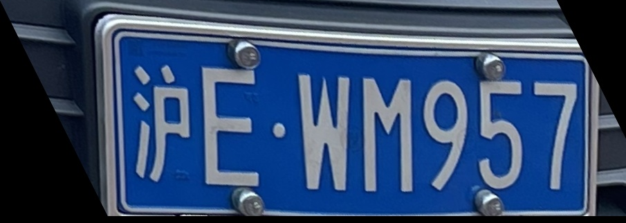

# SHANGHAI JIAO TONG UNIVERSITY

# **计算机视觉课程报告**


# 题目：<u>Back to the Non-deep-learning Era: 基于手工特征提取与自适应多尺度模板匹配的车牌字符定位与识别算法</u>


# 评分：____________________________________________________________________ 


# 学生姓名：<u>            迮炎杰                _</u>


# 学生学号:<u>       519021910706         _</u>


# 专业：<u>         计算机科学与技术       _</u>


# 学院：   <u> 电子信息与电气工程学院  _</u>


# 目录

[TOC]

## 绪论

随着深度学习技术在计算机视觉领域的蓬勃发展 [1] [2] [3]，越来越多的计算机视觉任务，如目标检测，语义分割，图像识别，得到较为高效的解决方案，并且大量的计算机视觉算法在工业界与人们的日常生活中得到了广泛的应用。

### 研究动机

现代人们的生活离不开车，而车牌识别任务，作为一个可以在人们日常生活中最常见的任务，因此具有其研究价值[4]。车牌识别任务的输入是一张包含车牌的照片，输出是图片中车的车牌号。这个任务的难点可以概括为以下几点：

1. 如何定位图片中车牌的位置。
2. 如何将车牌图片转换成文字。

现在较为先进的算法，通常采用深度学习的方法进行处理。第一步，对车牌进行目标检测，常用的目标检测算法有YOLO，SSD，MaskRCNN。第二步，对检测到的车牌进行字符识别，可以直接使用卷积神经网络（CNN）或者循环神经网络（RNN）进行分类和识别。

但是，在深度学习出现之前，人们难道就不能完成车牌识别任务了吗？当然是可以的。我们完全可以不借助深度学习，通过传统的视觉方法，如边缘检测，轮廓识别，模板匹配等等，实现一个车牌定位与识别的算法。当然，我们可以做到的原因在于：**车牌识别任务本身具有丰富的先验信息，即我们首先知道车牌的特征（颜色多为蓝色和绿色，形状为长方形），并且知道车牌号的内容是数字与字母的排列组合**。 这一强大的先验信息为我们使用非深度学习的算法提供了实践指导。

因此，本文将讨论如何使用非深度学习的计算机视觉方法，实现一个可以高效识别车牌的算法系统。在这一算法的实现过程中，我们不仅可以对经典的视觉算法进行回顾和熟悉，还可以对计算机视觉其本身有着更本质的认识——**如何高效地提取视觉特征和利用视觉特征**。

### 主要内容

本文主要介绍了一个基于非深度学习的车牌识别算法是如何实现的，其可以分为两步：

1. 车牌位置定位与分割算法
2. 自适应多尺度模板匹配算法

在车牌位置定位与分割算法的部分，我们通过一系列**图像预处理和轮廓判定**算法，从一张完整的图片中定位出车牌的位置和其最小包围矩形，从而将其从原图片中完整分割出来，并做一些**图像后处理**，以便进行字符识别。

在自适应多尺度模板匹配算法的部分，我们使用准备好的模板对车牌内容进行匹配，并通过**自适应、多尺度、非极大值抑制**等方法提升算法效果，最终获得车牌识别结果。


## 车牌位置定位与分割算法

为了将算法中的每一步都展现出来，以下部分我们采用图1作为一个测试样例，然后展示我们的算法输出怎样的效果。


<center>图1：测试图片</center>

### 基于颜色先验信息的图像预处理

为了将车牌位置提取出来，我们首先进行图像预处理。其基本思路是先做一些用sobel算子进行锐化处理，然后将RGB图片转换到HSV空间，进行基于颜色的分割。由于关于绿色的HSV值和关于蓝色的HSV值差别较大，为了达到更好的效果，我们提出了**基于颜色先验信息的图像预处理**，即将车牌颜色作为先验信息输入算法，从而可以获得更好的预处理效果。

具体来说，两种不同颜色的HSV域掩膜如下：

```python
		# 为绿色车牌设计的mask
    hsv_mask_for_img_green = (h > 60) & (h<70) & (s<90) & (v>150)

    # 为蓝色车牌设计的mask
    hsv_mask_for_img_blue = (h>90) &  (h<120) & (s>200) & (s<270) & (v>120) & (v<180)
```

图像预处理的结果如图2所示。可以看到，车牌的位置被很好地凸显了出来，这将有利于我们的后续操作。


<center>图2：图像预处理结果</center>

### 基于轮廓识别与检测框整合的车牌定位

使用预处理后的图像，我们可以进一步获得车牌的大概位置。

首先，用预处理的图像做一次轮廓检测，可以得到图3。


<center>图3：轮廓识别结果</center>

这里可以看出，轮廓有大有小，而车牌部分的轮廓是比较大的。因此，可以通过计算轮廓的外接矩形的面积，来初步判断是否是车牌区域，核心代码如下。其中我们用到一个自己定义的函数`rectangle_is_plate`，用来通过面积和长宽比来判断是否可能是车牌。

```python
for i, contour in enumerate(contours):
        
        rotate_rect = cv2.minAreaRect(contour)
        if rectangle_is_plate(rotate_rect):
            # 把可能的矩形框存储起来
            possible_rec_list.append(rotate_rect)
```

但是，这是一个初步的筛选，我们可以可视化一下现在得到的矩形框，如下图所示。可以发现，有可能会有一些矩形框聚集在车牌附近。


<center>图4：初步轮廓筛选结果</center>

为了将这些比较重合的框整合起来，一种方法是非极大值抑制（NMS）。但可以发现，我们的矩形框是有旋转角度的，这种情况下非极大值抑制很难实现，因此非极大值抑制针对的矩形框的长和宽一般是和x轴和y轴平行的。因此，我们直接实现一个类似的算法，称为`bbox_compression`，其主要思想是通过判断两个旋转矩形的外接正矩形的相交区域，来判断是否可以将两个旋转矩形整合起来。算法效果如下所示：


<center>图5：矩形框整合结果</center>

与此同时，我们也获得了车牌的位置，与矩形框的长、宽、旋转角度。

### 基于基本图像变换的车牌分割

获得了车牌的位置，我们接下来要将它分割出来，便于识别其中的字符。这里，我们主要用到一些基本的图像变换操作。可以归纳为以下四个步骤：

1. 旋转变换，将车牌从倾斜旋转到与长宽平行，如图6所示。
2. 图像裁剪，获得车牌区域，获得如图7所示。
3. 切变变换，将车牌从扭曲状态恢复，如图8所示。
4. 图像后处理，将一些因为变换造成的额外区域切割出去，如图9所示。


<center>图6：旋转后</center>


<center>图7：裁剪后</center>




<center>图8：切变后</center>


<center>图9：图像后处理</center>

至此，一个比较完美的车牌图片被我们从一张比较不规则的图片中提取了出来！接下来，我们需要将车牌图片中的字符识别出来。


## 自适应多尺度模板匹配算法

为了解决识别字符的问题，我们基于传统的模板匹配方法，提出适用于该问题的新算法，称为**自适应多尺度模板匹配算法**。该算法可被分成几个部分进行详细说明：自适应，多尺度模板匹配，非极大值抑制。

### 自适应
当我们对模板与原图进行尺度的调整的时候，是放大还是缩小是一个问题。为此，我们可以使用自适应的算法。该算法的思想是基于模板的长宽对scale参数进行调整，我们想要模板至少是比原图小一点的，因此最小的尺度`scale_low`不应该使得原图比模板还小，这样就无法进行模板匹配。具体实现如下，通过一个循环进行搜索，找到合适的`scale_low`。
```
    scale_low = 0.1
    scale_high = 1
    scale_num = 20
    while(gray.shape[1]*scale_low < tH):
        scale_low +=0.1
    scale_high = scale_low + 1.0
```

### 多尺度模板匹配

有了自适应的尺度上限和下限后，我们可以进行多尺度的模板匹配。通俗来讲，就是将我们的原图进行放大或缩小，将不同大小的原图分别进行模板匹配，并返回最匹配的时候的结果。

当然，首先我们需要建立一个模板库，如下图所示。


每一次多尺度匹配，需要输入车牌图片和一个模板图片，然后获得匹配结果。在运行时，我们需要对模板匹配库中的所有模板进行一次遍历，从而获得最佳的匹配结果。

多尺度模板匹配的最核心代码如下所示。我们首先对图片进行resize，然后用canny算法进行边缘检测，最后将两个图片进行模板匹配 (matchTemplate)。实际的实现中，还有很多工程细节，在代码文件`template_match.py`中。

```python
						resized = cv2.resize(gray, ( int(gray.shape[1]*scale),int(gray.shape[0] * scale) ) )
            r = gray.shape[1] / float(resized.shape[1])
            if resized.shape[0] < tH or resized.shape[1] < tW:
                print('resize shape too small, break')
                break
            
            edged = cv2.Canny(resized, 50, 200)
            
            result = cv2.matchTemplate(edged, template, cv2.TM_CCOEFF_NORMED)
            (_, maxVal, _, maxLoc) = cv2.minMaxLoc(result)
```


### 非极大值抑制
多尺度检测尽管带来了一定程度上的鲁棒性，却也带来了更多的检测结果需要筛选。如下图所示，每个区域有多个不同大小的检测框。实际上，这个问题在计算机视觉中的目标检测也经常出现，而最经典的解决方法即非极大值抑制 (NMS，Non-maximum Suppression)。

其算法步骤描述可以简要描述如下：
1. 输入包含一系列检测框的列表input list，按置信度进行排序。创建一个存储最终结果的列表result list。
2. 选取置信度最大的检测框记为current box，放入result list，并从input list中删去。
3. 对于input list中的检测框，计算和current box的IOU (intersection over union，交并比)。若是IOU大于一个threshold，则将这个检测框从input list中删去，否则保留。
4. 若是input list为空，则结束。否则回到步骤2。

非极大值抑制可以有效地将重复检测到的特征框去除，如下面两张图所示。可以看到，在进行了非极大值抑制后，检测的效果已经非常好了。


<center>图：没有非极大值抑制的结果</center>


<center>图：有非极大值抑制的结果 </center>


## 实验

由于我们的算法中超参数较多，如模板匹配时的阈值，非极大值抑制时的阈值，轮廓筛选时的面积，等等等，所以在我们的实验中，我们调出较好的参数来展示结果。同时，由于参数较多，而时间有限，本文作者也许没有找到最好的参数。我们的实验，如要求分为三个等级 ，按难度从低到高分为easy, medium, difficult。

我们仿照视觉中的IOU指标，提出字符IOU指标，ZIOU。ZIOU=正确预测的字符个数/（预测的字符+标签的字符的并集）。其实，字符的顺序也是需要考虑的指标。但由于我们的算法对于字符的顺序通过模板匹配的位置有排序，因此只会存在误识别的情况。因此，我们只考虑ZIOU。直观来讲，ZIOU同时衡量了准确率与误判率。

我们的结果总结如下。可以看到，我们的算法可以识别出来内容，但是由于模板匹配自身的缺陷，即匹配的重复性和难匹配性，会有一些错误识别、重复识别、漏识别。但是总体来说，效果可以接受。

以下代码可以直接通过`python main.py` 来运行获得。

| img id          | 1-1  | 1-2  | 1-3  | 2-1  | 2-2  | 2-3  | 3-1  | 3-2  | 3-3  |
| --------------- | ---- | ---- | ---- | ---- | ---- | ---- | ---- | ---- | ---- |
| ZIOU (fraction) | 7/9  | 4/10 | 6/9  | 7/8  | 6/9  | 7/9  | 7/8  | 8/10 | 7/9  |
| ZIOU (decimal)  | 0.78 | 0.40 | 0.67 | 0.88 | 0.67 | 0.78 | 0.88 | 0.8  | 0.78 |


### easy


### medium


### difficult


## 总结

本文探讨了如何使用非深度学习的方法来有效完成车牌识别任务。通过两阶段算法——定位分割，然后识别——我们的算法可以在测试数据上达到较好的ZIOU数值。此外，通过一系列详细的说明与步骤展示，我们一步步克服在车牌识别中遇到的问题，并提出了有效的算法。具体来说，本文提出了基于手工特征提取的车牌位置定位与分割算法和基于自适应多尺度模板匹配的车牌字符识别算法，有效解决了车牌定位、分割、字符识别的问题，并且无需深度学习中的训练阶段。但是，本算法不足之处在于参数较多，对于不同的图片需要有不同的参数从而达到最好的效果，不及深度学习鲁棒。因此，研究一个可以广泛适应于不同图片的非深度学习算法是本算法未来需要解决的问题。


## 引用文献

- [1] He, Kaiming, et al. "Deep residual learning for image recognition." *Proceedings of the IEEE conference on computer vision and pattern recognition*. 2016.
- [2] Goodfellow, Ian, Yoshua Bengio, and Aaron Courville. *Deep learning*. MIT press, 2016.
- [3] Simonyan, Karen, and Andrew Zisserman. "Very deep convolutional networks for large-scale image recognition." *arXiv preprint arXiv:1409.1556* (2014).

- [4] 苏云涛,余红英,迟进梓.基于LSTM算法的车牌识别系统方法研究[J/OL].电子测量技术:1-5[2021-11-22].http://kns.cnki.net/kcms/detail/11.2175.TN.20211028.2003.024.html.
- [5] 李向荣,焦学?,刘冬冬.基于YOLOv3算法的车牌识别优化算法[J].电子设计工程,2021,29(22):166-170.


## 谢辞

感谢计算机视觉这门课的赵旭老师给予我关于计算机视觉的指导，并给了我很多深刻的启发。感谢这门课的助教们的辛苦付出。感谢助教万潇月关于我提出的问题的热心回答。
